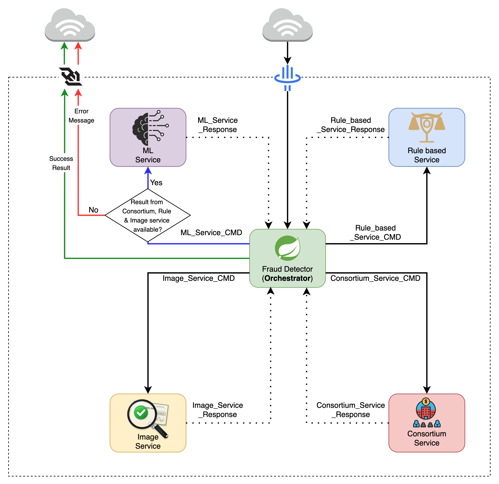

# System Architecture
Full Cheque fraud detection system follows a microservices architecture with the following components:
1. **fraud-detector**: This service acts as an orchestrator between all the other services. Receives deposit event ingestion, publishes kafka events to other services. Tracks the results from consortium and image services, publishes kafka event to ml service. Provides error or success response to the application through websocket.
2. **consortium-service**: Implements privacy-preserving techniques to enable cross-institution fraud detection without sharing raw PII data. It stores HMAC tokens, aggregate counts, risk scores, and fraud metadata to identify potential fraud patterns across multiple banks while maintaining data privacy.
3. **image-service**: Analyzes cheque images using computer vision techniques to extract features such as handwriting analysis, signature verification, and cheque alteration detection. It provides additional insights and risk factors for the ML scoring service.
4. **ml-service**: Receives events from the fraud-detector, processes the data using a machine learning model to generate a fraud risk score. The model is trained on historical data and incorporates features from the consortium and image services to improve accuracy.
5. **rules-service**: Implements a rules engine that evaluates the fraud risk score and other factors to determine the appropriate action (e.g., hold, manual review, pass). It allows for dynamic rule updates without redeploying the entire system.



## Included

- Spring Boot API: deposit ingest, alert/case workflow, rules engine, Kafka publish
- PostgreSQL schema: events, scores, rule hits, alerts, cases, audit
- Python FastAPI services:
  - ML scoring
  - image analysis placeholder
  - privacy-preserving consortium matching
- Synthetic data generator for 3–5 banks and fraud scenarios
- Docker Compose for PostgreSQL, Kafka, API, ML, image, consortium, Prometheus, Grafana

## Quick start

```bash
docker compose up --build
```

Generate synthetic CSVs:

```bash
python synthetic-data/generate_synthetic_data.py --out synthetic-data/out --banks 5 --events 2000
```

Example request:

```bash
curl -X POST http://localhost:8080/api/deposits \
  -H "Content-Type: application/json" \
  -d @examples/deposit_event.json
```

## Decision policy

```text
score >= 0.85 OR duplicate presentment => HOLD
score >= 0.60 OR consortium high risk => MANUAL_REVIEW
else PASS
```

## Privacy model

The consortium layer stores HMAC tokens, aggregate counts, risk scores, and fraud metadata. It does not store raw cross-institution PII.
