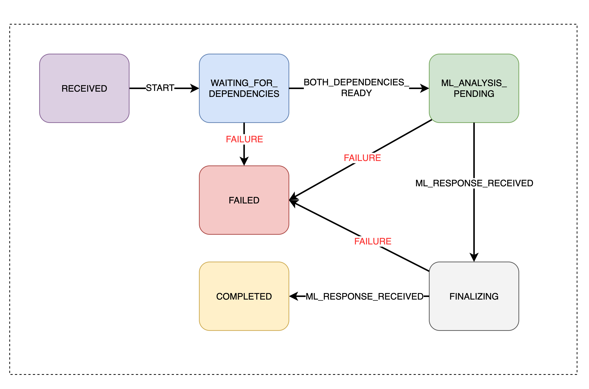

# SpringBoot State Machine for Check Fraud Detection

In order to control the asynchronous flow of the check fraud detection process, we used SpringBoot State Machine. This
allows us
to define different states and transitions based on events that occur during the fraud detection process.

The states of the StateMachine are as follows:

```java
public enum WorkflowState {
    RECEIVED,
    WAITING_FOR_DEPENDENCIES,
    ML_ANALYSIS_PENDING,
    FINALIZING,
    COMPLETED,
    FAILED
}
```

The corresponding events which will make the transitions from one state to another:

```java
public enum FraudEvent {
    START,
    BOTH_DEPENDENCIES_READY,
    ML_RESPONSE_RECEIVED,
    ALL_COMPLETED,
    FAILURE
}
```

## State Diagram



## State Transitions

1. *RECEIVED* - DepositEvent received by the statemachine
2. *WAITING_FOR_DEPENDENCIES* - Transitions to this state after sending CONSORTIUM_SERVICE_CMD, IMAGE_SERVICE_CMD and
   RULE_SERVICE_CMD to Kafka
3. *ML_ANALYSIS_PENDING* - Transitions to this state when response of both CONSORTIUM_SERVICE_CMD and IMAGE_SERVICE_CMD
   received and sends ML_SERVICE_CMD to Kafka
4. *FINALIZING* - Transitions to this state when response of ML_SERVICE_CMD received from Kafka
5. *COMPLETED* - Transitions to this state when response of both ML_SERVICE_CMD and RULE_SERVICE_CMD received
6. *FAILED* - Transitions to this state when any error happens in any of the services